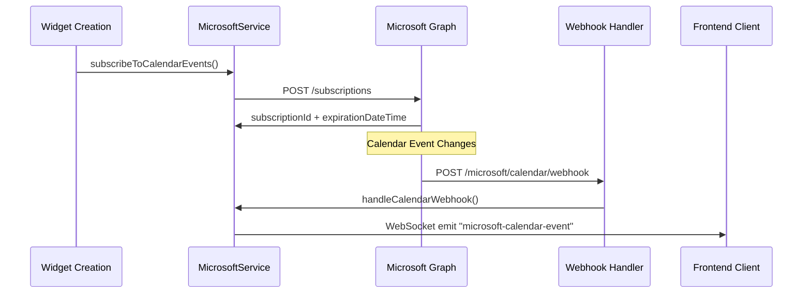

# Microsoft Graph Webhooks - Setup & Implementierung

## 📋 Überblick

Microsoft Graph Webhooks (Subscriptions) wurden implementiert analog zu Google Calendar Webhooks. Dies ermöglicht Echtzeit-Benachrichtigungen bei Calendar-Event-Änderungen.

## 🏗️ Implementierte Komponenten

### 1. **DTOs - Data Transfer Objects**
- `MicrosoftSubscriptionDTO` - Microsoft Graph Subscription Details
- `MicrosoftNotificationDTO` - Webhook Notification Payload
- `MicrosoftWebhookValidationDTO` - Webhook Validation

### 2. **Repository Interface Updates**
- `MicrosoftRepository.subscribeToCalendarEvents()` - Event Subscription erstellen
- `MicrosoftRepository.renewSubscription()` - Subscription verlängern  
- `MicrosoftRepository.deleteSubscription()` - Subscription löschen

### 3. **Microsoft Adapter Implementierung**
- **Subscription Creation**: Microsoft Graph API `/subscriptions` Endpoint
- **Expiration Management**: Automatische 3-Tage-Verlängerung (Max: 4230 Minuten)
- **Client State**: User-Dashboard-ID für Routing der Notifications
- **Change Types**: `created,updated,deleted` Event-Änderungen

### 4. **MicrosoftService - Business Logic**
- `subscribeToCalendarEvents()` - Token-validierte Subscription
- `handleCalendarWebhook()` - Webhook-Verarbeitung mit WebSocket-Emit

### 5. **MicrosoftController - HTTP Endpoints**
- `POST /microsoft/calendar/webhook` - Webhook-Handler
- `POST /microsoft/calendar/subscribe` - Manual Subscription
- **Webhook Validation**: Automatische `validationToken` Response

### 6. **Route Updates**
- Microsoft Webhook-Endpoints zu `microsoftRoutes.ts` hinzugefügt
- Scopes erweitert: `Calendars.ReadWrite` für Subscriptions

## 🔧 Setup-Anforderungen

### Environment Variable
```bash
# .env
MICROSOFT_CALENDAR_WEBHOOK_URL=https://your-domain.com/api/microsoft/calendar/webhook
```

### Microsoft Azure App Registration
1. **Redirect URI**: Bestehende OAuth-Config
2. **Webhook URL**: `MICROSOFT_CALENDAR_WEBHOOK_URL` 
3. **API Permissions**:
   - `Calendars.Read` ✅ (bereits vorhanden)
   - `Calendars.ReadWrite` ✅ (neu hinzugefügt)
   - `User.Read` ✅ (bereits vorhanden)

### SSL/HTTPS Requirement
- Microsoft Graph **erfordert HTTPS** für Webhook URLs
- Entwicklung: ngrok, localtunnel, oder Reverse Proxy
- Produktion: SSL-Zertifikat erforderlich

## 🚀 Verwendung

### 1. **Automatische Subscription (über Widget)**
```typescript
// Widget-Service registriert automatisch Subscriptions
// Analog zu Google Calendar Widget-Erstellung
```

### 2. **Manuelle Subscription**
```bash
POST /api/microsoft/calendar/subscribe?dashboardId=123&calendarId=calendar-id
Authorization: Bearer {jwt-token}
```

### 3. **Webhook Verarbeitung**
```typescript
// Microsoft sendet POST zu: /api/microsoft/calendar/webhook
// Controller verarbeitet Notifications und emittiert WebSocket Events
```

## 📊 Webhook Flow



## 🔄 Unterschiede zu Google Calendar

| Feature | Google Calendar | Microsoft Graph |
|---------|-----------------|-----------------|
| **Subscription Endpoint** | `/calendars/{id}/events/watch` | `/subscriptions` |
| **Max Duration** | 1 Woche | ~3 Tage (4230 Min) |
| **Validation** | `X-Goog-Channel-Token` | `validationToken` Query |
| **Change Types** | Implizit | Explizit: `created,updated,deleted` |
| **Resource Format** | Channel ID | `me/calendars/{id}/events` |

## ⚠️ Wichtige Hinweise

### Subscription Limits
- **Maximum**: 4230 Minuten (~3 Tage)
- **Renewal**: Manuell via `renewSubscription()` erforderlich
- **Auto-Renewal**: Implementierung empfohlen (Cron Job)

### Error Handling
- **401 Unauthorized**: Token abgelaufen → Re-Authentication
- **403 Forbidden**: Insufficient Permissions → Scopes prüfen
- **Webhook Failures**: Microsoft wiederholt max. 4x

### Security
- **Client State**: Enthält `userId-dashboardId` für Routing
- **Validation**: Webhook-URL wird von Microsoft validiert
- **HTTPS Only**: Keine HTTP-Endpoints erlaubt

## 🎯 Nächste Schritte

1. **Environment Setup**: `MICROSOFT_CALENDAR_WEBHOOK_URL` setzen
2. **Azure Config**: `Calendars.ReadWrite` Permission hinzufügen  
3. **HTTPS Setup**: SSL für Webhook-URL konfigurieren
4. **Testing**: Widget mit Microsoft Calendar testen
5. **Auto-Renewal**: Cron Job für Subscription-Verlängerung implementieren

Die Microsoft Graph Webhooks sind jetzt vollständig implementiert und folgen dem gleichen Pattern wie Google Calendar Webhooks! 🎉